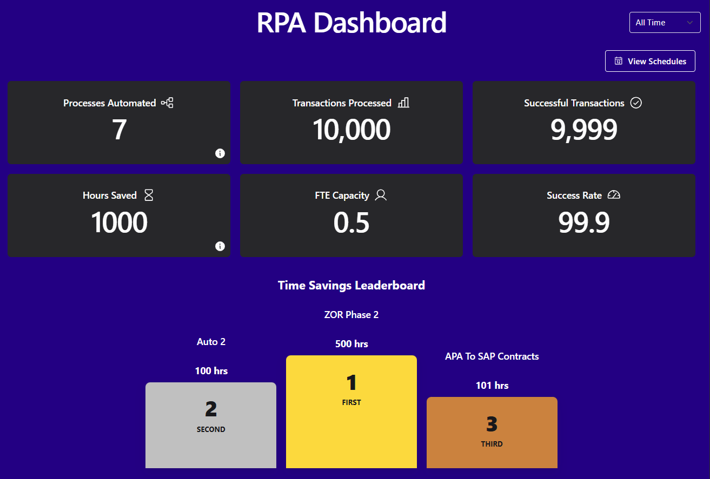
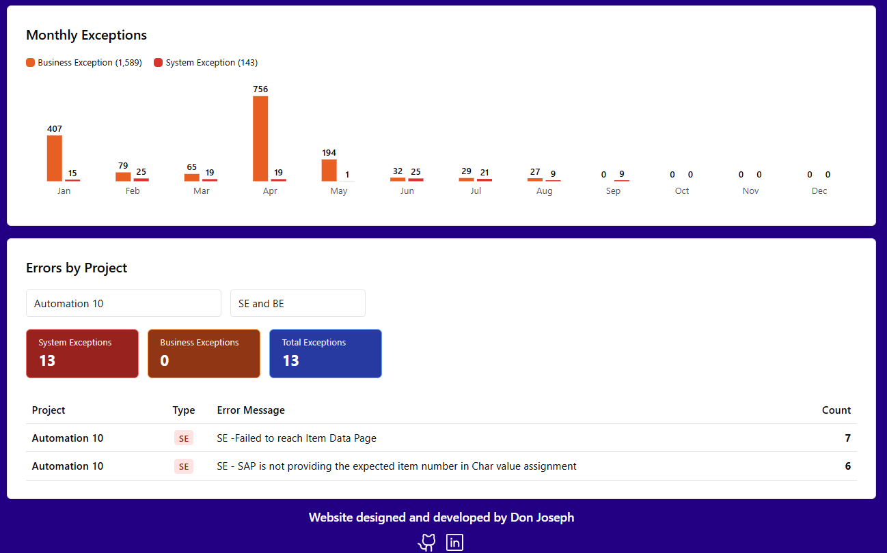
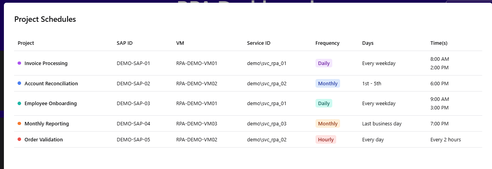

# RPA Metrics Dashboard

A full-stack business intelligence dashboard that surfaces the impact of UiPath robotic process automations, giving leadership visibility into transaction volume, time savings, and process health.

---

## Screenshots

> **Privacy note:** All values, project names, identifiers, schedules, errors, and metrics shown in these screenshots must use demonstration data. Production information must not be committed to this repository.

### KPIs, Leaderboard & Performance


### Errors by Project


### Project Schedule Matrix

---

## Overview

When an automation team runs dozens of bots across an organization, it can be hard for leadership to answer the question: *"What are these automations actually doing for us?"* This dashboard answers that question.

The application queries a SQL Server reporting table containing UiPath transaction data. It does not require access to the UiPath Orchestrator API. Transaction records are aggregated into business-impact and technical-performance metrics.

Key design goals:
- **Live data** — metrics are pulled from SQL Server at runtime
- **Flexible date filtering** — All Time, YTD, This Month, Last Month, and specific-year views
- **Impact reporting** — transaction volume, hours saved, FTE capacity, and estimated cost equivalent
- **Technical performance** — project and year filtering for successful transactions and exceptions
- **Exception transparency** — SE and BE totals with exact-message tallies by project

---

## Features

| Feature | Description |
|---|---|
| KPI Cards | Processes Automated, Transactions Processed, Successful Transactions, Hours Saved, FTE Capacity, and Technical Success Rate |
| Time Savings Leaderboard | Date-filtered project ranking with a podium for the top three automations |
| Monthly Successful Transactions | Monthly successful volume with independent project and year selectors |
| Monthly Exceptions | Monthly SE and BE counts using the same project and year selection |
| Technical Success Rate | All-time project cards with an independent project selector and Successful, SE, and BE counts |
| Errors by Project | Date-filtered exact-message tallies with project and exception-type selectors |
| Project Schedules | Schedule, SAP ID, VM, and service ID overview using demonstration data in the public repository |
| Date Range Filter | All Time, YTD, This Month, Last Month, and specific-year filtering for impact and error widgets |
---

## Tech Stack

### Frontend
| Technology | Purpose |
|---|---|
| **React 19** | Component-based UI framework |
| **Vite** | Fast dev server and build tool |
| **Chakra UI** | Accessible, composable component library |
| **Recharts** | Declarative charting built on D3 |
| **Axios** | HTTP client for API calls |
| **Phosphor Icons** | Icon library |

### Backend
| Technology | Purpose |
|---|---|
| **Node.js** | JavaScript runtime |
| **Express.js** | REST API framework |

### Database
| Technology | Purpose |
|---|---|
| **Microsoft SQL Server** | Reporting data source containing UiPath transactions |
| **mssql** | SQL Server driver for Node.js |

---

## Getting Started

### Prerequisites
- Node.js v18+
- Windows with ODBC Driver 18 for SQL Server installed
- Network access to the SQL Server reporting database
- Windows account access to `[DS_ADHOC_BOPs].[rpa].[Master_Impact_Report]`

### 1. Clone the repository

```bash
git clone https://github.com/mtvdonpablo/RPADashboard.git
cd RPADashboard
```

### 2. Install dependencies

Install both frontend and backend packages:

```bash
cd Frontend && npm install
cd ../Backend && npm install
```

### 3. Configure environment variables

Create a `.env.development.local` file inside the `Backend/` directory:

```env
PORT=3001
SQL_SERVER=your_sql_server_address
SQL_DATABASE=your_database_name
SQL_SERVER_PORT=your_sql_server_port
PROJECT_IDS=comma_separated_list_of_project_ids
FTE_HOURS_PER_YEAR=your_fte_hours_per_year
```

| Variable | Description |
|---|---|
| `SQL_SERVER` | Hostname or IP of your SQL Server |
| `SQL_DATABASE` | SQL Server reporting database name |
| `SQL_SERVER_PORT` | SQL Server port (default: 1433) |
| `PROJECT_IDS` | Comma-separated UiPath project IDs to include |
| `FTE_HOURS_PER_YEAR` | Optional working hours per year used for FTE calculations (default: 1960) |

The backend uses Windows integrated authentication. Database usernames and passwords are not read from the environment file.

### 4. Configure project savings assumptions

Update `Backend/config/projectMetrics.js` when adding or changing a project:

```js
["15", {
  timeSavedMinutes: 5,
  avgWagePerMinuteInCents: 51,
}]
```

- `timeSavedMinutes` is the estimated employee time saved per successful transaction.
- `avgWagePerMinuteInCents` is used only for the estimated cost equivalent shown in the Hours Saved details.
- Projects missing from this configuration contribute zero time and cost savings.
- Estimated cost is the value of time returned, not a realized budget reduction.

### 5. Start the development servers

Backend (from `/Backend`):
```bash
npm run devStart
```

Frontend (from `/Frontend`):
```bash
npm run dev
```

The frontend dev server proxies API requests to the backend, so no additional CORS configuration is needed in development.

---

## Metric Definitions

| Metric | Definition |
|---|---|
| Processes Automated | Number of project IDs configured in `PROJECT_IDS` |
| Transactions Processed | Successful transactions plus recognized system and business exceptions |
| Successful Transactions | Records whose status is `Pass` |
| Hours Saved | Successful transactions multiplied by each project's configured minutes saved |
| FTE Capacity | Hours saved divided by `FTE_HOURS_PER_YEAR` |
| Technical Success Rate | Successful transactions divided by successful transactions plus system exceptions |

Business exceptions do not reduce Technical Success Rate because they represent source-data or business-rule conditions outside the bot's control.

## Exception Classification

- Error messages beginning with `SE` are treated as System Exceptions.
- Error messages beginning with `BE` are treated as Business Exceptions.
- Known database messages that were not prefixed correctly are normalized as System Exceptions by the shared rules in `Backend/Routes/projects.js`.
- System Exception rules take precedence when a malformed message also begins with `BE`.

---

*Designed and developed by [Don Joseph](https://www.linkedin.com/in/don-j/)*
